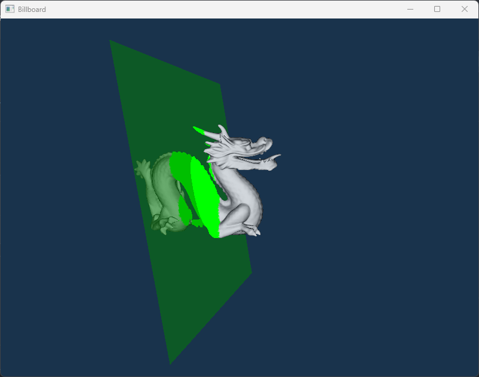

# Billboard Cloud Simplification Tool


<p align="center">
    
     
    
    
</p>


This OpenGL application is an educational tool designed to help students understand the concepts of the **Billboard Clouds for Extreme Model Simplification** paper. It provides an interactive visualization of a 3D model, allowing users to explore Valid and Miss planes, adjust the epsilon value, and view the simplified billboard representation.

## Features

- **3D Model Visualization**: A dragon model is rendered using OpenGL, allowing users to navigate around the model with the camera.
- **Valid and Miss Planes**: Users can see Valid planes (green) and Miss planes (red), providing a visual representation of the planes involved in the billboard cloud simplification process.
- **Epsilon Value Adjustment**: Users can adjust the epsilon value, which changes the acceptance criteria for what is valid
- **Alpha Value Adjustment**: Users can adjust the alpha value, which changes the distance between planes and consequently the bounds for Valid and Miss sets
- **Color-Coded Points**: Vertices in the Valid and Miss sets are color-coded (green for Valid, red for Miss) to give users a better understanding of the valid representation for each point.
- **Projection Mode**: Users can enable Projection Mode to visualize the billboard representation. In this mode, the 3D model disappears, and the vertices from the Valid and Miss sets are projected onto their respective planes.

## Getting Started

### Prerequisites

- OpenGL

### Installation

1. Clone the repo:
   ```
   git clone https://github.com/yourusername/billboard-cloud-simplification-tool.git
   ```

2. Compile the project (we used Visual Studio 2022 Community).

3. Run the application.

## Usage

- Use the mouse to navigate around the dragon model and observe the Valid and Miss planes.
- Adjust the epsilon and alpha values to see how it affects the distance between planes and the bounds of the Valid and Miss sets.
- Enable Projection Mode to visualize the simplified billboard representation.

```
    Program Usage:
    1 - Main Camera
    2 - Side Camera
    ______________________
    Left/Right Arrow - Move plane forward/backward
    Scroll Wheel - Rotate plane
    Press Scroll Wheel - Change rotation axis
    ______________________
    Up/Down Arrow - Increase/Decrease EPSILON
    SHIFT + Left/Right Arrow - Decrease/Increase ALPHA
    z - Project VALID Set
    x - Project MISS Set
    c - Drop Projection
```

## References

1. [Billboard Clouds for Extreme Model Simplification)](https://graphics.cs.yale.edu/sites/default/files/bc03_0.pdf/)
